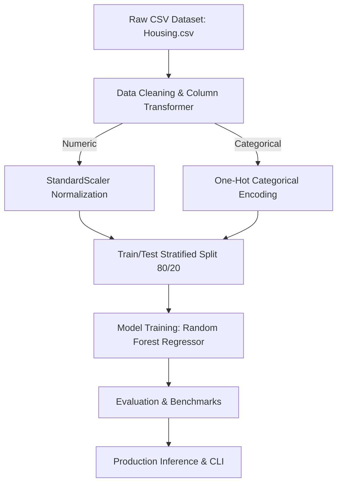

# Real Estate Housing Market Analytics & Price Prediction - Architecture & Pipeline Design

## Comparative Models Evaluated
- **Random Forest Regressor**
- **XGBoost Regressor**
- **Ridge Regression**
- **ElasticNet**
